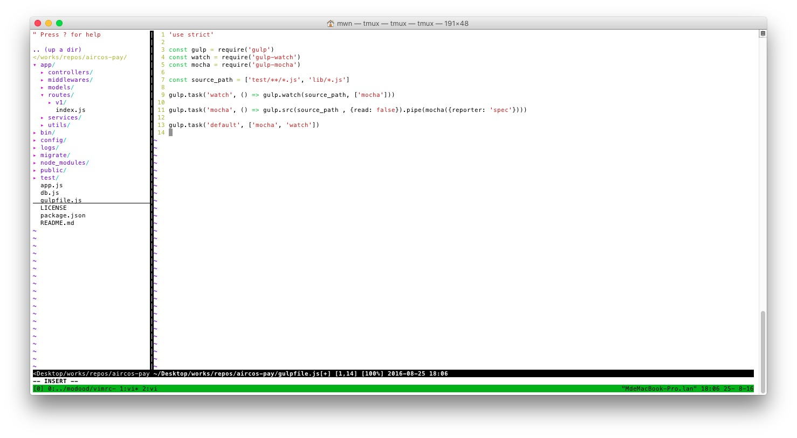

# vimrc
A shell script to deploy my vim configuration

## preview


## install
The installation will overwrite your `.vimrc` file, be sure to backup your existing vim configuration.

```
$ git clone https://github.com/modood/vimrc.git
$ cd vimrc
$ ./deploy.sh
```

## keyboard shortcuts

*   Basic

| key | description |
|:----|:------------|
| `<C-z>` | Suspend |
| `<C-r>` | Redo changes |
| `<C-t>` | New tab |
| `<C-i>` | indent |
| `<C-o>` | Jump back to the previous location |
| `<C-e>` | Scroll window [count] lines downwards |
| `<C-y>` | Scroll window [count] lines upwards |
| `<C-d>` | Scroll window Downwards |
| `<C-u>` | Scroll window upwards |
| `<C-f>` | Scroll window |
| `<C-a>` | Select all contents of the file |
| `<C-c>` | Copy selected text |
| `<C-v>` | Paste |
| `<C-;>` | Show clipboard |
| `<C-w>hjkl` | moves between Vim viewports |
| `<C-hjkl>`  | moves between Vim viewports |
| `<Leader>w` | Write the current file |
| `<Leader>q` | Exit |
| `<Leader>qq` | Write the current file and exit |

*   [syntastic](https://github.com/vim-syntastic/syntastic)

| key | description |
|:----|:------------|
| `<Leader>e`  | Show list of errors and warnings on the current file |
| `<Leader>np` | Turn to next or previous errors, after open errors list |

*   [vim-go](https://github.com/fatih/vim-go)

| key | description |
|:----|:------------|
| `<Leader>r`  | Build and run current main package |
| `<Leader>b`  | Build current package |

*   [nerdcommenter](https://github.com/scrooloose/nerdcommenter)

| key | description |
|:----|:------------|
| `[count]<leader>cs` | Comments out the selected lines |
| `[count]<leader>c<space>` | Toggles the comment state of the selected line(s) |

*   [nerdtree](https://github.com/scrooloose/nerdtree)

| key | description |
|:----|:------------|
| `<C-n>` | Toggle |
| `<C-m>` | Find the current file in the tree |
| `?`     | Got help |
| `<S-i>` | 显示隐藏文件 |
| `<S-a>` | 最大化显示左侧目录 |

*   [vim-multiple-cursors](https://github.com/terryma/vim-multiple-cursors)

| key | description |
|:----|:------------|
| `<C-g>` | cursor next |
| `<C-b>` | cursor prev |
| `<C-x>` | cursor skip |

*   [ctrlp.vim](https://github.com/kien/ctrlp.vim)

| key | description |
|:----|:------------|
| `<C-p>`         | Invoke CtrlP in find file mode |
| CtrlP: `<c-fb>` | Cycle between modes |
| CtrlP: `<c-d>`  | switch to filename only search instead of full path |
| CtrlP: `<c-r>`  | switch to regexp mode |
| CtrlP: `<c-jk>` | navigate the result list |
| CtrlP: `<c-t>`  | open the selected entry in a new tab |
| CtrlP: `<c-v>`  | open the selected entry in a new split |
| CtrlP: `<c-x>`  | open the selected entry in a new split |
| CtrlP: `<c-y>`  | create a new file and its parent directories |
| CtrlP: `<c-z>`  | mark/unmark multiple files and <c-o> to open them |
| CtrlP: `<F5>`   | Refresh the match window and purge the cache for the current directory |

*   [vim-expand-region](https://github.com/terryma/vim-expand-region)

| key | description |
|:----|:------------|
| `<v>` | expand region expand |

*   [vim-easymotion](https://github.com/easymotion/vim-easymotion)

| key | description |
|:----|:------------|
| `<s>` | s{char} to move to {char} |

## contributing
1. Fork it
2. Create your feature branch (`git checkout -b my-new-feature`)
3. Commit your changes (`git commit -am 'Add some feature'`)
4. Push to the branch (`git push origin my-new-feature`)
5. Create new Pull Request

## license
this repo is released under the [MIT License](http://www.opensource.org/licenses/MIT).
